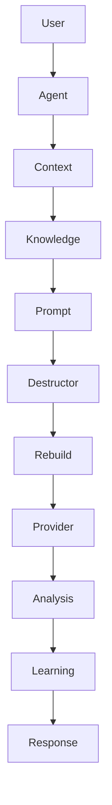

# Workflow

```mermaid
graph TD;
    User-->Agent;
    Agent-->Context;
    Context-->Knowledge;
    Knowledge-->Prompt;
    Prompt-->Destructor;
    Destructor-->Rebuild;
    Rebuild-->Provider;
    Provider-->Analysis;
    Analysis-->Learning;
    Learning-->Response;
```
